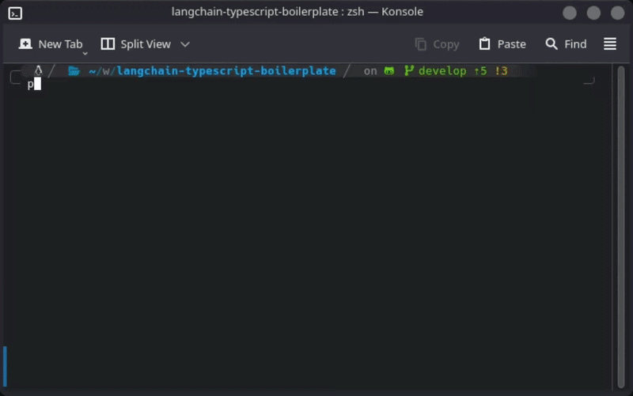

# AI Agent Boilerplate

A simple AI agent built with TypeScript using LangChain that responds with information about a fictional company using search tools and a basic RAG system, which uses Qdrant for vector storage and better-sqlite3 to store metadata of the knowledge base files.

> [!WARNING] This AI agent was one of the first I created, so it may not be well optimized for real use, especially due to the formulation of the prompts.

## Preview

<p align="center">
  
</p>

## Table of contents

- [Features](#features)
- [Agent](#agent)
    - [Tools](#tools)
- [Vectorization](#vectorization)
    - [Embeddings](#embeddings)
    - [Vector storage](#vector-storage)
    - [Metadata storage](#metadata-storage)
- [Using this agent](#using-this-agent)
    - [Running Qdrant](#running-qdrant)
    - [Running Ollama](#running-ollama)
    - [Cloning the repo](#cloning-the-repo)
    - [Running the agent](#running-the-agent)
- [Building the agent](#building-the-agent)
- [Contributing](#contributing)
- [License](#license)

## Features

- **Free**, since it runs the embeddings model locally with Ollama and uses Groq, which provides free credits
- **Smart vectorization** of the knowledge base for RAG
- **Verbose mode** to follow the response generation process
- The **chat** works directly in the **terminal**
- **tsgo** for type-checking (I decided to use it as a test, but it's useful in case the project scales)

## Agent

The agent was built with LangChain in conjunction with the integration of Groq, using the `openai/gpt-oss-120b` model, and uses LangGraph for managing the state of the message history.

### Tools

The agent currently has two tools that can be used to handle user requests, namely:

- `search_knowledge_base`: tool to search for a query within the knowledge base. It uses the concept of RAG to search for chunks of information that may be useful.
- `get_products`: tool to return all products present in the knowledge base.

## Vectorization

### Embeddings

So that the project could run for free to facilitate testing, I wanted to use a model provided by Ollama to create embeddings (vectors). The model I used locally and that is defined in the `.env.example` was `nomic-embed-text-v2-moe`, which supports over 100 languages and is very well optimized, [you can access the official page here](https://ollama.com/library/nomic-embed-text-v2-moe). You can choose another model if you want, just adjust the settings correctly.

### Vector storage

As vector storage, I decided to use [Qdrant](https://qdrant.tech/documentation/quickstart/) to store the vectors resulting from the generation of the aforementioned embedding model and use them in the RAG system.

### Metadata storage

In this project, the `better-sqlite3` library was used to store the metadata of the knowledge base files. These stored metadata are basically the `source`, which is the path to the file in the knowledge base, and `hash`, which is the hash of the file's content, used to perform the comparison and check whether the file has been modified or not.

The verification is performed to avoid having to call the embeddings model to generate new vectors for all the knowledge base files every time the application is initialized. With this verification, it becomes possible to generate vectors only for the files that have actually been modified or that have not yet had the initial vectors generated.

## Using this agent

To run this agent locally, you need to follow some steps, considering that it depends on some external services.

### Running Qdrant

This project was made to work with Qdrant running locally, so if you are using Qdrant in the cloud, you may need to make some changes.

To run Qdrant on your local machine, according to the [official documentation](https://qdrant.tech/documentation/quickstart/), you can follow these steps:

1. First, download the latest Qdrant image from Dockerhub:

```bash
docker pull qdrant/qdrant
```

2. Then, run the service:

```bash
docker run -p 6333:6333 -p 6334:6334 \
    -v "$(pwd)/qdrant_storage:/qdrant/storage:z" \
    qdrant/qdrant
```

> [!WARNING] On Windows, you may need to create a named Docker volume instead of mounting a local folder.

### Running Ollama

To install Ollama, you can access the [download page](https://ollama.com/download) and run the suggested command on your machine.

After doing this, you can check if Ollama was installed correctly on your machine, for that, run the following command:

```bash
ollama --version
```

Now it will be necessary to download an embeddings model. You can use the one I initially defined (`nomic-embed-text-v2-moe`), or use any other of your preference, as long as you configure it correctly in your environment variables. To download, just run the command:

```
ollama pull nomic-embed-text-v2-moe # or other model
```

As the last step, just start Ollama:

```bash
ollama serve &
```

### Cloning the repo

After starting the services into your machine, you need to clone this repository. To get this repository into your local machine, just run the following command:

```bash
git clone https://github.com/lucaaszsx/langchain-typescript-boilerplate ./assistant-agent
cd ./assistant-agent # navigate to the local repo folder
```

### Running the agent

After cloning this repository, you will be able to run the agent. To begin, you should start by creating your file with the environment variables. To do this, you can just copy the content of `.env.example` and put into the `.env` file. Just like this (if you're using a Linux-based distro):

```bash
cp .env.example .env
```

Having the file with the environment variables, open it and replace it with your own credentials and change whatever else you need.

Now, install the project dependencies:

```bash
pnpm install
```

After installing the dependencies, you can run the agent and test it:

```bash
pnpm run dev
# or pnpm run dev:watch, if you're doing changes at src code
```

## Building the agent

To build this application, simply run the following command:

```bash
pnpm run build
```

The build files will be generated in the `dist/` directory.

## Contributing

Actually, I created this repository with the sole purpose of recording some learnings. But contributions are welcome, if you want you can submit an issue to report a problem or even open a pull request to add a new feature.

## License

This project is licensed under the MIT License. See [LICENSE](./LICENSE) for full license text.
